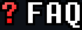

<h2 align="center">an <a href="https://gamejolt.com/games/spdusttaledesperation/1018009">SP!Dusttale take</a> directed by Ketchupsans_2009</h2>

build 20260009

Note: As of 6/17/2026, this game is permanently cancelled due to [Ketchupsans_2009's actions](https://gamejolt.com/p/so-you-ve-probably-been-wondering-what-s-been-going-on-with-the-ga-87utjtba). The old README and source, however, will stay up, because I believe that all code should be open source.

 - Toby Fox and Temmie Chang: Created UNDERTALE 
 - 反正是sprins就对了: Created Canon!SP!Dusttale 
 - xxbredxx-357: NECROPTOSIS (Track) 
 - Ketchupsans_2009: Writing, sprites 
 - Tinnpangpang: Music 
 - dustedsylvia: Coding 
 - Full credits in-game 

build 20260009: 
 - Added an RGB shader. 
 - Further work on NECROPTOSIS has been completed. 
 - Added a vignette to the beginning of the fight. 
 - Fixed the lag (there were a lot of surface_create calls that i didnt know about...) 
 - Added Discord Rich Presence 
 - Added more attacks 

Q: When will the game release? 
A: We don't have a specific release date in mind, but it will be released by the end of 2026, and most likely much earlier. 
 
Q: Can I use *song or sprite* for *your content here*? 
A: No, not without EXPLICIT permission from Ketchupsans_2009. More legalities are below. 

Q: Is this project dead? 
A: No. In fact, as of writing this, it is nearing completion. 

Q: What platforms will this release for? 
A: Windows, MacOS, and Linux, for starters. An Android port may be released someday. 

Q: Will there be official translations for this game? 
A: At this time, it is hard to give a certain answer, but it is entirely possible that we will translate the game into German. 

Q: Is this game canon to SP!Dusttale? 
A: No. This is a take on SP!Dusttale by Ketchupsans_2009. 

This game was built in the latest version of <a href="https://gamemaker.io/en/download">GameMaker BETA</a> (click the "GameMaker BETA version" dropdown). Once you've installed GameMaker for your platform, download/clone this repo and open the `yyp` file.

**You are not permitted to copy, redistribute, modify, or use the sprites, music, artwork, code, writing, or other original assets created specifically for this fangame without permission from Ketchupsans_2009. All original content created for this fangame is owned by Ketchupsans_2009. Unauthorized use, reproduction, or distribution of these original assets may result in a cease-and-desist notice or other legal action where permitted by applicable copyright and intellectual property laws.** 
**UNDERTALE and its original characters, assets, and trademarks belong to Toby Fox. This fangame is a non-commercial fan project and is not affiliated with or endorsed by Toby Fox.**

*This README was last updated on Wednesday, June 3rd, 2026. Any legal information in any previous versions of the README are no longer applicable as of this date.*

© dustedsylvia and ketchupsans_2009 2026-present. All rights reserved.
