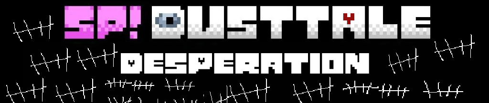

<h2 style="text-align: center;">an SP!Dusttale take directed by Ketchup_sans2009</h2>

ver. nightly-9

This GitHub repository contains all of the source code for SP!Dusttale: desperation. You can find the GameJolt page [here](https://gamejolt.com/games/spdusttaledesperation/1018009).

version nightly-9:
 - Added an RGB shader.
 - Further work on NECROPTOSIS has been completed.
 - Added a vignette to the beginning of the fight.
 - Fixed the lag (there were a lot of surface_create calls that i didnt know about...)
 - Added Discord Rich Presence
 - Added more attacks

 - Toby Fox and Temmie Chang: Created UNDERTALE
 - 反正是sprins就对了: Created the original AU
 - NECROPTOSIS by xxbredxx-357
 - Ketchupsans_2009: Writing, sprites, music
 - Coding by dustedsylvia
 - Full credits in-game

{ style="text-align: center;" }
This game was built in the latest version of [GameMaker BETA](https://gamemaker.io/en/download) (click the "GameMaker BETA version" dropdown). Once you've installed GameMaker for your platform, download/clone this repo and open the `yyp` file.

You are not permitted to copy, redistribute, modify, or use the sprites, music, artwork, code, writing, or other original assets created specifically for this fangame without permission from Ketchupsans_2009. All original content created for this fangame is owned by Ketchupsans_2009. Unauthorized use, reproduction, or distribution of these original assets may result in a cease-and-desist notice or other legal action where permitted by applicable copyright and intellectual property laws.  
UNDERTALE and its original characters, assets, and trademarks belong to Toby Fox. This fangame is a non-commercial fan project and is not affiliated with or endorsed by Toby Fox.

This README was updated on Wednesday, June 3rd, 2026. Any legal information in any previous versions of the README are no longer applicable as of this date.